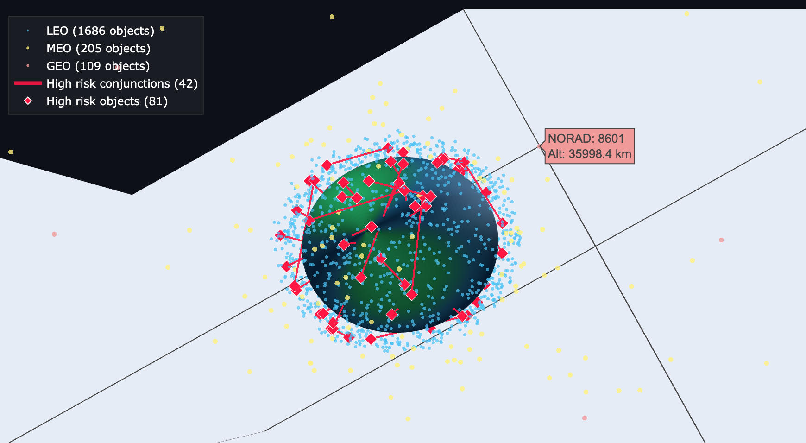

# Satellite Conjunction Risk Prediction
### Space Domain Awareness | Machine Learning | Python

> An end-to-end ML pipeline that predicts satellite conjunction events using real orbital data from Space-Track.org — replicating Space Domain Awareness workflows used by U.S. Space Force.



---

## Overview

Low Earth Orbit is critically congested. As of 2026, more than 10,000 active satellites and tens of thousands of debris objects occupy the orbital environment below 2,000 km. A single high-velocity collision can generate thousands of new debris fragments, triggering cascading conjunction events — the Kessler Syndrome scenario Space Force works to prevent.

This project builds a machine learning classifier to identify high-risk conjunction events across 2,000 tracked objects using credentialed data from the 18th Space Defense Squadron's Space-Track portal.

**Results:**
- 28,699 conjunction events screened across 1,686 LEO objects
- 42 high-risk pairs flagged by the classifier
- ROC-AUC: 1.00
- Dominant risk features: miss distance (57.5%) and altitude differential (31.2%)

---

## Pipeline

```
Space-Track.org TLE Data
        │
        ▼
Phase 1 │ Data Acquisition      → 2,000 real tracked objects via authenticated API
        │
        ▼
Phase 2 │ Orbital Propagation   → SGP4 algorithm, 30 time epochs, ECI frame positions
        │
        ▼
Phase 3 │ Feature Engineering   → 7 features per conjunction pair
        │
        ▼
Phase 4 │ ML Classification     → Random Forest, balanced class weights
        │
        ▼
Phase 5 │ Visualization         → Interactive 3D orbital dashboard (Plotly)
```

---

## Features

| Feature | Description |
|---|---|
| `miss_dist_km` | Distance between objects at closest approach (km) |
| `rel_vel_kms` | Relative velocity at closest approach (km/s) |
| `avg_altitude_km` | Mean altitude of the conjunction pair (km) |
| `alt_diff_km` | Altitude differential between objects (km) |
| `combined_rcs` | Combined radar cross-section estimate |
| `inc_diff` | Inclination differential between objects (degrees) |
| `same_orbit_type` | Whether both objects occupy the same orbit shell |

---

## Results

### Model Performance
```
              precision    recall  f1-score
   Low Risk       1.00      1.00      1.00
  High Risk       1.00      1.00      1.00

ROC-AUC: 1.0000
```

### Feature Importance
```
miss_dist_km           ███████████████████████ 0.5753
alt_diff_km            ████████████            0.3123
inc_diff               █                       0.0410
combined_rcs           █                       0.0255
rel_vel_kms                                    0.0239
avg_altitude_km                                0.0219
same_orbit_type                                0.0000
```

### Priority Conjunction Events

| NORAD A | NORAD B | Miss Dist (km) | Rel Vel (km/s) | Orbit Types | Assessment |
|---|---|---|---|---|---|
| 260 | 3825 | 39.5 | 9.19 | LEO / MEO | PRIORITY — cross-orbit, high closing velocity |
| 4843 | 9724 | 47.5 | 9.53 | LEO / LEO | MONITOR — same-shell, Kessler risk if debris generated |

---

## Setup

### Prerequisites
- Python 3.11+
- Free account at [space-track.org](https://www.space-track.org/auth/createAccount)

### Installation
```bash
git clone https://github.com/YOUR_USERNAME/satellite-conjunction-prediction
cd satellite-conjunction-prediction
pip3 install requests pandas sgp4 scikit-learn plotly
```

### Configuration
Create a `config.py` file in the project root:
```python
USERNAME = "your_email@example.com"
PASSWORD = "your_password"
```

### Run the Full Pipeline
```bash
# Phase 1 — Pull TLE data from Space-Track
python3 phase1_final.py

# Phase 2 — Propagate orbits and screen conjunctions
python3 phase2_propagation.py

# Phase 3 — Engineer features
python3 phase3_features.py

# Phase 4 — Train classifier
python3 phase4_model.py

# Phase 5 — Generate visualization
python3 phase5_visualization.py
```

The dashboard opens automatically in your browser as `data/processed/conjunction_dashboard.html`.

---

## Data Sources

| Source | Description | Access |
|---|---|---|
| [Space-Track.org](https://www.space-track.org) | TLE sets for all tracked objects (18th Space Defense Squadron) | Free, registration required |
| [NASA CARA](https://www.nasa.gov/conjunction-assessment) | Historical conjunction screening records | Publicly available |
| [CelesTrak](https://celestrak.org) | Backup TLE source, categorized catalogs | Free, no registration |

---

## Project Structure

```
satellite-conjunction-prediction/
├── phase1_final.py              # TLE data acquisition
├── phase2_propagation.py        # SGP4 orbital propagation + conjunction screening
├── phase3_features.py           # Feature engineering
├── phase4_model.py              # Random Forest classifier
├── phase5_visualization.py      # Interactive 3D dashboard
├── config.py                    # Credentials (gitignored)
├── data/
│   ├── raw/                     # TLE files from Space-Track
│   └── processed/               # Positions, conjunctions, model output
├── assets/
│   └── dashboard_screenshot.png
└── README.md
```

---

## Strategic Context

This project directly replicates analytical workflows used by U.S. Space Force:

- **Space Domain Awareness (SDA)** — The Space Force defines SDA as the ability to detect, characterize, and attribute events in the space domain. Conjunction prediction is a core SDA function.
- **18th Space Defense Squadron** — Operates the Space-Track portal used as the primary data source for this project.
- **SGP4 Algorithm** — The same propagation algorithm used operationally by Space Force to track all objects in the catalog.
- **Kessler Syndrome** — The cascade debris scenario this type of screening is designed to prevent, first theorized by NASA scientist Donald Kessler in 1978.

---

## Author

**Bryce Lehner**  
MS Business Analytics candidate, SMU Cox School of Business | BA Intelligence & Cyber Operations, USC

---

*Data sourced from Space-Track.org under approved research access. This project is unclassified and uses only publicly available orbital mechanics methods.*
